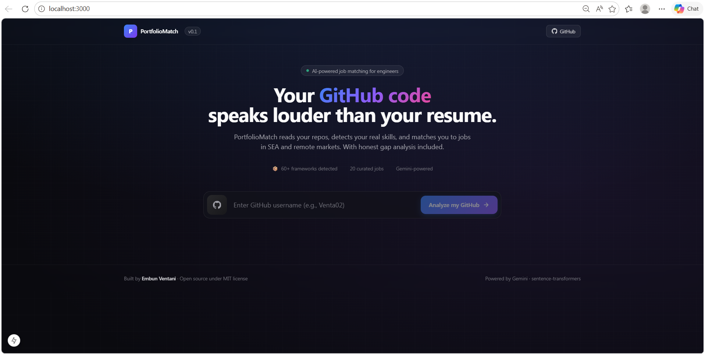

# PortfolioMatch

> **AI-Powered Job Matching from Your GitHub Code**
> 從你的 GitHub 程式碼自動匹配職缺與分析技能差距

[](https://www.python.org/)
[](https://fastapi.tiangolo.com/)
[](https://nextjs.org/)
[](https://opensource.org/licenses/MIT)

---



## Demo Video

[![Watch the demo]](docs/demo.mp4)

> Click the image above or [watch the demo video here](docs/demo.mp4).

---

## Overview / 專案概述

**PortfolioMatch** analyzes your real GitHub repositories to detect technical skills, then matches them against job descriptions using a hybrid scoring algorithm. It provides a percentage match score, identifies missing skills, and uses Google Gemini to generate personalized project ideas to close the gap.

**PortfolioMatch** 透過分析你 GitHub 上的真實儲存庫來偵測技術能力，並使用混合評分演算法將其與職缺描述進行匹配。系統提供百分比匹配分數、識別缺失的技能，並使用 Google Gemini 生成個人化的專案建議來縮小差距。

### Why this exists / 為什麼做這個

Most job matching tools rely on self-reported skills from resumes, which are often inflated or vague. PortfolioMatch grounds the analysis in your actual code, dependency files, and commit history, producing an honest, evidence-based skill profile.

大部分求職工具依賴履歷上的自填技能，這些資訊往往誇大或模糊。PortfolioMatch 直接分析你的程式碼、依賴檔案與提交紀錄，產出一份誠實、有證據支持的技能檔案。

---

## Key Features / 主要功能

| Feature | Description |
|---------|-------------|
| **GitHub Code Analysis** | Parses `requirements.txt`, `package.json`, `Cargo.toml`, `go.mod` and detects 60+ frameworks across Python, JavaScript, Rust, Go |
| **GitHub 程式碼分析** | 解析依賴檔案，跨語言偵測 60+ 框架 |
| **Semantic Matching** | Uses `sentence-transformers/all-MiniLM-L6-v2` for embedding-based similarity |
| **語意匹配** | 使用 sentence-transformers 進行嵌入相似度計算 |
| **Hybrid Scoring** | Combines cosine similarity with skill overlap: `0.5 × cosine + 0.5 × overlap` |
| **混合評分演算法** | 結合餘弦相似度與技能重疊度 |
| **Gap Analysis** | Google Gemini Flash Lite generates 3 personalized project ideas to close skill gaps |
| **技能差距分析** | Gemini Flash Lite 生成 3 個個人化專案建議 |
| **REST API** | 6 documented endpoints with OpenAPI/Swagger UI at `/docs` |
| **REST API 端點** | 6 個端點，附帶 OpenAPI/Swagger 文件 |

---

## Architecture / 系統架構


The system consists of three main layers / 系統包含三個主要層級：

1. **Profile Building / 個人檔案建立** – Next.js frontend → FastAPI gateway → GitHub API → Skill Extractor → User Profile
2. **ML Pipeline / 機器學習管線** – Sentence Transformers embeddings → Hybrid Scorer → Top K Matches
3. **Gap Analysis / 差距分析** – Google Gemini Flash Lite → Personalized project recommendations

---

## Tech Stack / 技術棧

### Backend / 後端
- **Python 3.11** – Core language
- **FastAPI 0.115** – Async REST API framework
- **sentence-transformers** – Hugging Face embedding models
- **PyGithub** – GitHub API client
- **Google Gemini API** – Generative AI for gap analysis
- **Pydantic v2** – Data validation

### Frontend / 前端
- **Next.js 15.1** – React framework with App Router
- **TypeScript 5** – Type-safe development
- **Tailwind CSS 3.4** – Utility-first styling
- **shadcn/ui** – Component library

### Infrastructure / 基礎設施
- **Docker Compose** – Local orchestration
- **Anaconda** – Python environment management

---

## Quick Start / 快速開始

### Prerequisites / 環境需求

- Python 3.11+
- Node.js 20+ with `pnpm`
- A GitHub Personal Access Token (read-only scope is enough)
- A Google AI Studio API key (free tier works)

### 1. Clone the repository / 複製儲存庫

```bash
git clone https://github.com/Venta02/portfoliomatch.git
cd portfoliomatch
```

### 2. Backend setup / 後端設定

```bash
cd backend

# Create environment
conda create -n portfoliomatch python=3.11 -y
conda activate portfoliomatch

# Install dependencies
pip install -r requirements.txt

# Configure secrets
cp .env.example .env
# Edit .env and add:
#   GITHUB_TOKEN=ghp_xxxxxxxxxxxx
#   GEMINI_API_KEY=AIzaSyxxxxxxxxxxxx

# Run the API
uvicorn app.main:app --reload --port 8000
```

The API will be available at `http://localhost:8000` and the interactive docs at `http://localhost:8000/docs`.

API 將在 `http://localhost:8000` 啟動，互動式文件位於 `/docs`。

### 3. Frontend setup / 前端設定

Open a new terminal window:

```bash
cd frontend
pnpm install
pnpm dev
```

The frontend runs at `http://localhost:3000`.

前端執行於 `http://localhost:3000`。

### 4. Try it / 試用

1. Open `http://localhost:3000`
2. Enter a GitHub username (try `Venta02`)
3. Wait for the analysis to complete (10-20 seconds)
4. Browse matched jobs and click any job to see the gap analysis

---

## API Endpoints / API 端點

| Method | Endpoint | Description |
|--------|----------|-------------|
| `POST` | `/api/analyze` | Analyze a GitHub user and build a skill profile |
| `POST` | `/api/match` | Match a profile against the job dataset |
| `POST` | `/api/gap` | Generate gap analysis with Gemini |
| `GET`  | `/api/jobs` | List all available jobs |
| `GET`  | `/api/jobs/search` | Search jobs by keyword |
| `GET`  | `/api/health` | Health check |

Full schemas are auto-generated and viewable at `/docs` (Swagger UI) or `/redoc`.

完整的 schema 由 FastAPI 自動產生，可在 `/docs` (Swagger UI) 或 `/redoc` 查閱。

---

## Project Structure / 專案結構

```
portfoliomatch/
├── backend/
│   ├── app/
│   │   ├── main.py                  # FastAPI app entry
│   │   ├── routes/                  # API route handlers
│   │   ├── services/
│   │   │   ├── github_analyzer.py   # GitHub repo parsing + skill detection
│   │   │   ├── matcher.py           # Hybrid scoring engine
│   │   │   └── gap_analyzer.py      # Gemini integration
│   │   ├── schemas/                 # Pydantic models
│   │   └── data/
│   │       └── sample_jobs.json     # 20 SEA + remote jobs
│   ├── requirements.txt
│   └── .env.example
├── frontend/
│   ├── app/                         # Next.js App Router pages
│   ├── components/                  # React components
│   ├── lib/                         # API client + utilities
│   └── package.json
├── docs/
│   ├── architecture.png             # System architecture diagram
│   ├── hero.png                     # Hero image for README
│   └── demo.mp4                     # Demo walkthrough video
├── docker-compose.yml
├── LICENSE
└── README.md
```

---

## How Scoring Works / 評分機制

For each job, the system computes:

```
final_score = 0.5 × cosine_similarity + 0.5 × skill_overlap
```

Where / 其中：

- **cosine_similarity** – Dot product of normalized embeddings between user profile and job description (captures semantic meaning)
- **餘弦相似度** – 使用者檔案與職缺描述的嵌入向量相似度（捕捉語意）
- **skill_overlap** – `|user_skills ∩ job_skills| / |job_skills|` (captures concrete skill matches)
- **技能重疊度** – 使用者技能與職缺要求技能的交集比例（捕捉具體技能匹配）

This hybrid approach balances semantic understanding (which catches related-but-different terms like "Vue" matching "frontend") with hard skill matching (which prevents false positives where embeddings are too generous).

這種混合方法在語意理解（能匹配「Vue」與「前端」這類相關但不同的詞彙）與硬技能匹配（避免嵌入模型過於寬鬆造成的誤判）之間取得平衡。

---

## Limitations / 已知限制

Honest disclosure of what this project does **not** do well yet:

誠實揭露目前還做不好的部分：

- **Sample dataset only** – The 20 jobs in `sample_jobs.json` are curated for demo purposes, not scraped from live job boards.
- **資料集為樣本** – 目前 20 個職缺為展示用，並非從實際求職網站抓取。
- **No private repo support** – Only public GitHub data is analyzed.
- **不支援私人儲存庫** – 僅分析公開 GitHub 資料。
- **English-first NLP** – The embedding model performs best on English; multilingual support is on the roadmap.
- **以英語為主** – 嵌入模型主要支援英語，多語言為未來規劃。
- **Single-user** – No authentication or persistence; the system is stateless per request.
- **單一使用者** – 無認證機制，每個請求皆為無狀態。

---

## Roadmap / 未來規劃

- [ ] Real-time job scraping from LinkedIn, JobStreet, Glints
- [ ] 整合 LinkedIn、JobStreet、Glints 即時職缺
- [ ] Multilingual embeddings (Indonesian, Mandarin, Malay)
- [ ] 多語言嵌入模型（印尼語、中文、馬來語）
- [ ] User accounts with saved profiles and match history
- [ ] 使用者帳號與比對紀錄
- [ ] Resume PDF parsing as alternative input
- [ ] 履歷 PDF 解析作為替代輸入方式

---

## License / 授權

MIT License. See [LICENSE](LICENSE) for details.

採用 MIT 授權，詳見 [LICENSE](LICENSE)。

---

## Author / 作者

**Embun Ventani**
M.Sc. Computer Science and Information Engineering, NYUST Taiwan

- GitHub: [github.com/Venta02](https://github.com/Venta02)
- LinkedIn: [linkedin.com/in/embun-ventani](https://www.linkedin.com/in/embun-ventani/)
- Email: embunventani@gmail.com

---

## Acknowledgments / 致謝

- [Hugging Face](https://huggingface.co/) for the `sentence-transformers` ecosystem
- [Google AI Studio](https://aistudio.google.com/) for free Gemini API access
- [FastAPI](https://fastapi.tiangolo.com/) and [Next.js](https://nextjs.org/) communities

---

<p align="center">
  Built with care in Pangkalpinang, Indonesia<br>
  在印尼邦加檳港用心打造
</p>
